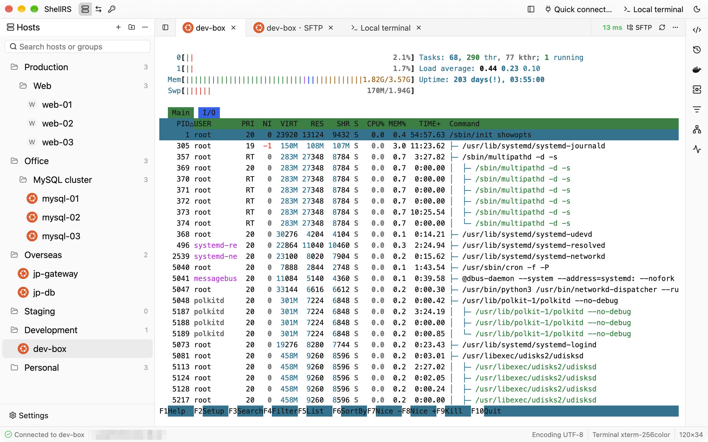
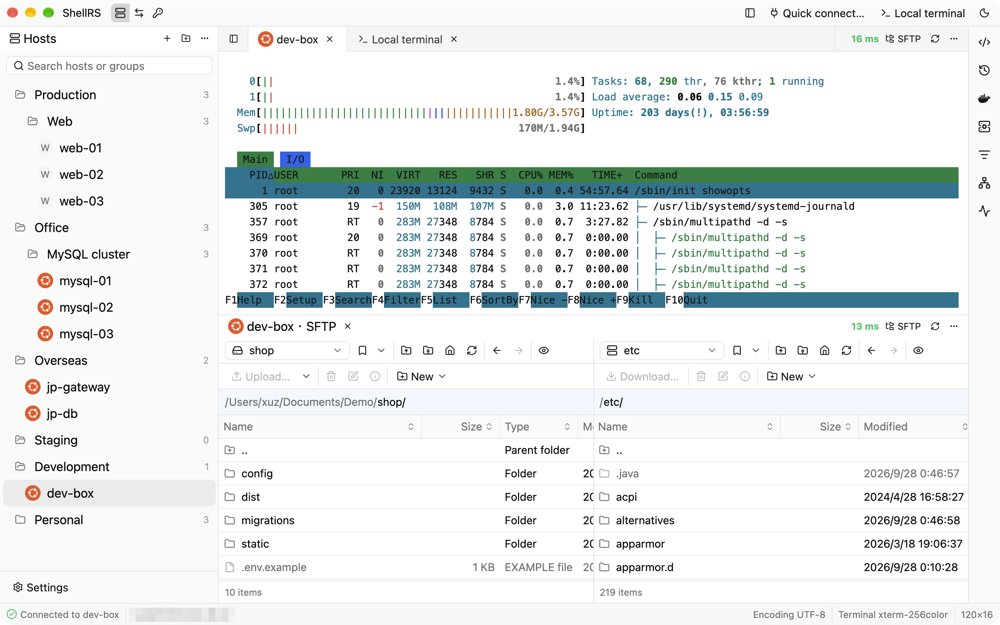
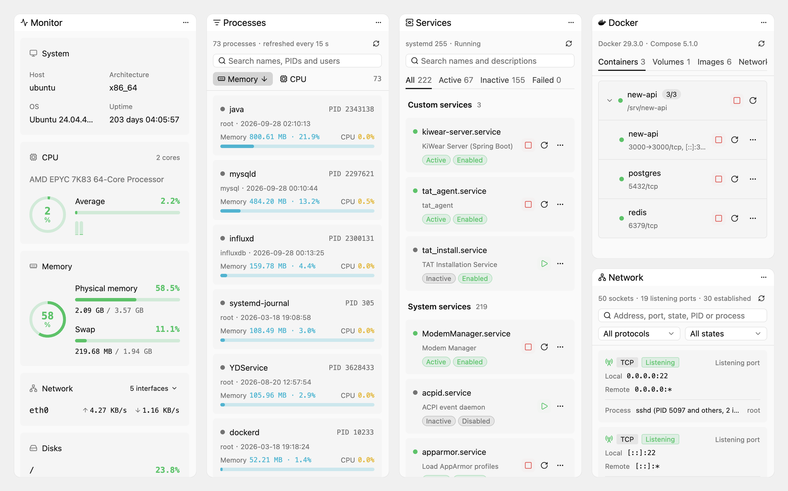
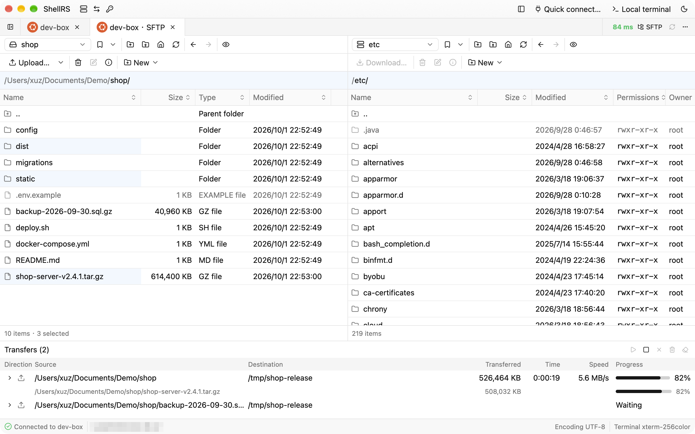
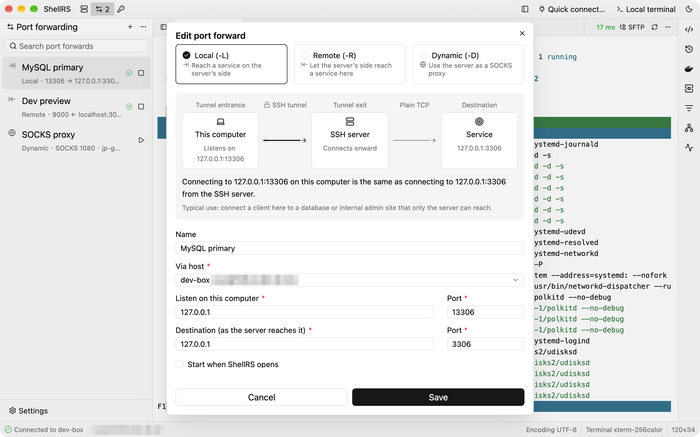

<p align="center">
  
</p>

<h1 align="center">ShellRS</h1>

<p align="center">
  A high-performance, native, cross-platform SSH client written in Rust, with a GPU-rendered interface: Xshell-style host management, WinSCP-style SFTP and port forwarding, all in one window.
</p>

<p align="center">
  <a href="https://github.com/since2006/shell-rs/releases"></a>
  <a href="#license"></a>
  
  
  <a href="https://linux.do"></a>
</p>

<p align="center"><b>English</b> | <a href="README.zh-CN.md">简体中文</a></p>

<picture>
  <source media="(prefers-color-scheme: dark)" srcset="docs/screenshots/en/main-dark.png">
  
</picture>

## About

ShellRS brings Xshell-style host management and tabbed terminals, a WinSCP-style dual-pane SFTP browser and SSH port forwarding together in one cross-platform app, which bastion hosts such as JumpServer can launch the way they launch Xshell and WinSCP. It is written in Rust, and its UI is built on GPUI, the GPU-accelerated UI framework of the Zed editor (through [gpui-kit](https://gpui-kit.com)). There is no Electron and no JVM.

Hosts, groups, credentials and forwarding rules live in a local SQLite database. Passwords and key passphrases go only into the system keychain (macOS Keychain, Windows Credential Manager, Linux Secret Service); the database never holds a secret. ShellRS also ships a `shellrs` command that lets AI agents such as Claude Code or Codex run commands and transfer files on your saved hosts without ever seeing a password.

## Features

**Hosts**

- Groups nest to any depth; drag to rearrange, type to search.
- The remote OS is detected on connect and shown as a badge in the host tree and on tabs (Linux distributions, the BSDs, macOS, Windows).
- Three ways to log in: password; no password (the server's `none` auth, then the SSH agent, then the default keys in `~/.ssh`); or a saved credential.
- Three ways to connect: directly, through a chain of SSH jump hosts, or through an HTTP or SOCKS5 proxy. Terminals, SFTP, port forwards and the CLI all follow it.
- "Test connection" performs a real login and explains any failure.

**Terminal**

- Tabbed remote and local terminals (built on `alacritty_terminal`); full-screen programs like vim and htop work as expected.
- Each tab shows the SSH round-trip latency live.
- Find (smart case) and local clear; configurable font, size and line height.
- Drag tabs into side-by-side or stacked splits to watch a terminal and SFTP together.

**Right sidebar tools**

- They follow the current remote terminal and read and run on that terminal's own connection, with no second login. ⌘⌥B (Ctrl+Alt+B elsewhere) shows or hides them.
- System monitor: system details, CPU (per core too), memory, network rates and disk use, refreshed every 2 seconds.
- Network connections, processes and services: search and filter, process details, ending processes, starting, stopping and restarting systemd services, switching them on at boot, and their logs. These three and the monitor are for Linux only.
- Docker: containers grouped by compose project, with start, stop, restart, details and logs, plus volumes, images and networks. When not root, passwordless sudo is used (for services as well).
- Command history reads `~/.bash_history` on the host, and snippets, shared by every host, can be sorted into categories; click one to type it into the terminal, or run it straight away.

**SFTP**

- A dual-pane browser modeled on WinSCP Commander: symmetric local and remote panes with WinSCP's columns, path labels, bookmarks and shortcuts (F5, F2, F7, F8…).
- Upload and download by dragging or by shortcut, recursively. Start new transfers while one runs; they wait in a per-tab transfer queue.
- Resumable transfers: data goes to a `.filepart` first, dropped connections are retried after 1, 3 and 10 seconds, and after a restart ShellRS offers to resume the same transfer.
- Delete (local items go to the Trash), rename, create, and change permissions (a 3×3 grid plus octal, optionally recursive).
- Built-in editor: double-click a text file to edit it, ⌘S writes it back in place, after checking nobody else changed it; syntax highlighting for common formats. Images and Markdown can be previewed.
- Each SFTP tab has its own connection and asks only for the SFTP subsystem, so no shell is needed on the server.

**Opening from a bastion host**

- Launched the way Xshell and WinSCP are: in the client of a bastion host such as JumpServer, set ShellRS as the SSH or SFTP client. An `ssh://` link opens a terminal, an `sftp://` link an SFTP tab.
- Understands Xshell's `-url` and `-newtab` and WinSCP's `/sessionname=`. When ShellRS is already running, the link opens there.
- What opens is an unsaved external connection: it stays out of the host list, keeps the link's password in memory only and goes away with its tabs. Each connection uses a single channel, so bastion hosts that allow no more still work. See the [user manual](docs/manual.en.md#opening-from-a-bastion-host-external-connections).

**Port forwarding**

- Local (`-L`), remote (`-R`) and dynamic (`-D`, SOCKS5 / SOCKS4) forwards.
- The rule dialog draws a live diagram and a one-line explanation of where connections enter and where they go.
- Every rule keeps its own SSH connection and reconnects three times after a drop; rules can start with ShellRS.

**Credentials**

- Password, key and SSH agent credentials that many hosts can share. Change a credential and every host using it follows.
- Keys can reference a file on disk, be pasted in, or be generated on the spot (Ed25519 or RSA 4096), with the public key one click away.

**A CLI for AI agents**

- `shellrs hosts` / `credentials` / `exec` / `upload` / `download` / `sync`: manage hosts and credentials, run commands, move and sync files. The running ShellRS logs in on the command's behalf, so the command itself never reads a password or private key.
- Install `shellrs` into your PATH and an Agent Skill for Claude Code, Codex, OpenCode or WorkBuddy from the settings page.

**Security and updates**

- Secrets stay in the system keychain. Host keys are recorded in ShellRS's own `known_hosts`, never in `~/.ssh`.
- In-app updates: the update manifest is minisign-signed and each package is checked against its SHA-256. Updates download in the background and install on restart or quit. There are stable and beta channels, and an update check sends only the version, OS and CPU architecture.
- Anonymous usage statistics: sent to Aptabase with only the version, OS, CPU architecture and how often each feature is used, never hosts, credentials, commands or any identifier. Turn them off in Settings › About.

## Screenshots

<p align="center">
  <br>
  <em>Dock splits: a remote terminal and SFTP stacked in one window</em>
</p>

<p align="center">
  <br>
  <em>Right sidebar tools: Monitor, Processes, Services, Docker and Network</em>
</p>

<p align="center">
  <br>
  <em>WinSCP-style SFTP: highlight selection and a transfer queue with progress, speed and time left</em>
</p>

<p align="center">
  <br>
  <em>Port forwarding: the diagram shows where each connection goes</em>
</p>

## Download

Download from [shellrs.com/download](https://shellrs.com/download), which offers the package for your system, or from GitHub [Releases](https://github.com/since2006/shell-rs/releases). Betas are marked Pre-release there; to get new features early, switch the update channel to Beta in Settings › About.

| System | Package | Notes |
| --- | --- | --- |
| macOS 11+ (Apple Silicon and Intel) | `ShellRS-<version>-macos-universal.dmg` | Signed and notarized. Open the DMG and drag ShellRS into Applications |
| Windows x64 | `ShellRS-<version>-windows-x86_64-setup.exe` | Installs per user, no administrator rights needed. The installer is not signed yet; if SmartScreen stops it, choose "More info › Run anyway" |
| Linux x64 | `ShellRS-<version>-linux-x86_64.AppImage` | `chmod +x` and run. Needs glibc 2.35 or newer (Ubuntu 22.04, Debian 12 and later) |

Every package comes with a minisign signature (`.minisig`), and each release has a `SHA256SUMS` file.

Once installed, ShellRS keeps itself up to date: it checks, downloads and verifies new versions in the background, then shows an icon in the top-right corner of the title bar; click it and choose "Restart to update", or just quit and the update is installed on the way out. Automatic updates are unavailable when ShellRS runs from inside the DMG or outside the Applications folder, or on Linux when it isn't run as the AppImage.

## Getting started

1. Click "New host…" in the title bar (⌘N, or Ctrl+N on Windows and Linux) and fill in the address, port and login. Passwords go into the system keychain.
2. Double-click a host to open a terminal. On the first connection you're asked to confirm the host key.
3. Right-click a host and choose "Open SFTP", or click "SFTP" at the right of the terminal's tab bar. Drag files between the two panes to transfer them.
4. The three icons after "ShellRS" in the title bar switch the sidebar between hosts, port forwards and credentials.
5. ⌘T (Ctrl+T) opens a local terminal. Drag a tab to the top, bottom, left or right edge of the tab area to split it.

## For AI agents

In Settings › External CLI, turn on Enable external CLI, then install the `shellrs` command and the Agent Skills. Your agent can then use the hosts you have saved:

```sh
shellrs hosts list -q web                          # list hosts and their IDs
shellrs exec <ID> "uptime && df -h"                # run a command; the exit code is the remote one
shellrs upload <ID> ./dist/app.tar.gz /opt/app/    # upload
shellrs download <ID> /var/log/syslog ./logs/      # download
shellrs sync <ID> ./dist /opt/app --delete         # sync a folder, skipping unchanged files
```

The command hands each request to the running ShellRS, which logs in with the saved settings and keychain. An unknown host or a missing password fails right away with a stable error code instead of a prompt that would hang the agent. See the [user manual](docs/manual.en.md#external-cli) for details.

## Building from source

Install [rustup](https://rustup.rs). The repository's `rust-toolchain.toml` pins Rust 1.98.1, which rustup installs on the first build.

```sh
git clone https://github.com/since2006/shell-rs.git
cd shell-rs
cargo run
```

The first build compiles the whole GPUI stack and takes a while. See [development notes](docs/development.md) (in Chinese) for the Linux system packages and how to run the tests.

## Documentation

Apart from the user manual, the documentation is in Chinese for now:

- [User manual](docs/manual.en.md): every feature in detail, with shortcuts
- [Development](docs/development.md): building, testing, the data directory
- [Releasing](docs/release.md): packaging, signing and publishing updates
- [Changelog](CHANGELOG.md)

## Roadmap

Not implemented yet:

- Directory sync, filtering, file search and a directory tree in SFTP
- Keeping the Dock layout across restarts
- Combining a jump host chain with a proxy, and HTTPS proxies
- Managing port forwards and credentials through the external CLI
- Code signing for the Windows installer

## Contributing

Issues and pull requests are welcome on [GitHub](https://github.com/since2006/shell-rs/issues). Architecture notes and code conventions are in [CLAUDE.md](CLAUDE.md) (in Chinese). Before sending a change, make sure these pass:

```sh
cargo fmt --check
cargo clippy --all-targets -- -D warnings
cargo test
```

## Acknowledgements

- [GPUI](https://github.com/zed-industries/zed) (Zed) and [gpui-kit](https://gpui-kit.com): the UI framework
- [russh](https://github.com/Eugeny/russh) and [russh-sftp](https://github.com/AspectUnk/russh-sftp): SSH and SFTP
- [alacritty_terminal](https://crates.io/crates/alacritty_terminal) and [portable-pty](https://crates.io/crates/portable-pty): terminal emulation and local PTYs
- [keyring](https://crates.io/crates/keyring): the system keychain
- [Simple Icons](https://simpleicons.org): the OS logos on host badges and the Docker logo in the right sidebar (CC0)
- [WinSCP](https://winscp.net) and Xshell: the interaction designs ShellRS follows

## License

ShellRS is licensed under the [GNU General Public License v3.0](LICENSE). You may use, modify and redistribute it, commercially or not, but any modified version you distribute must come with its complete source code under the GPL-3.0 as well.
