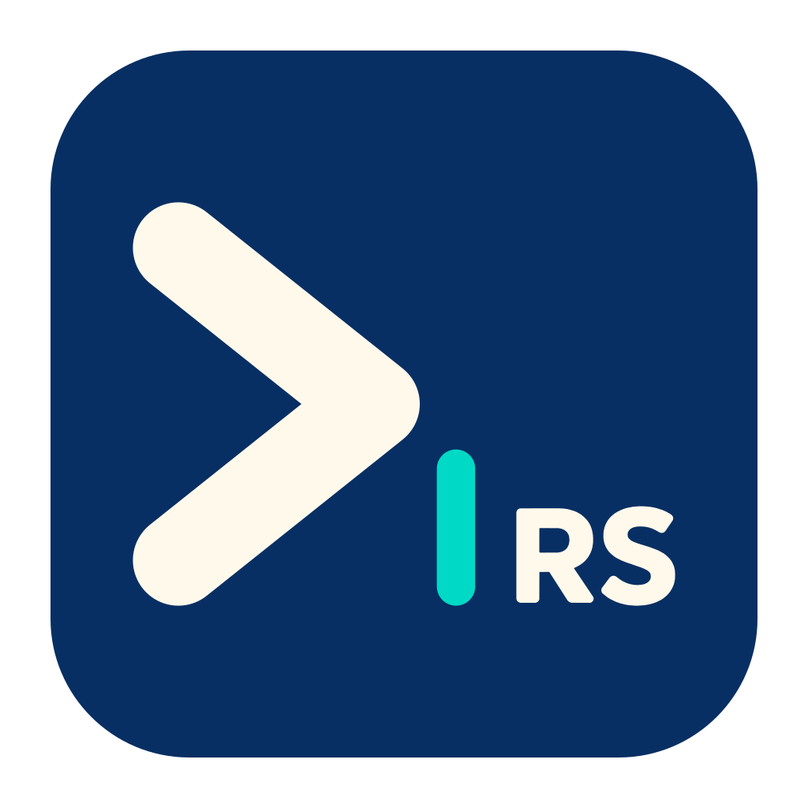
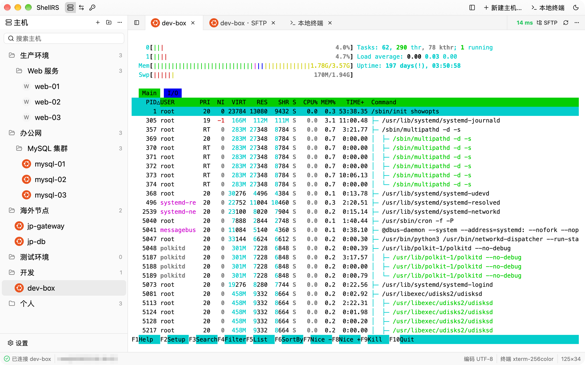
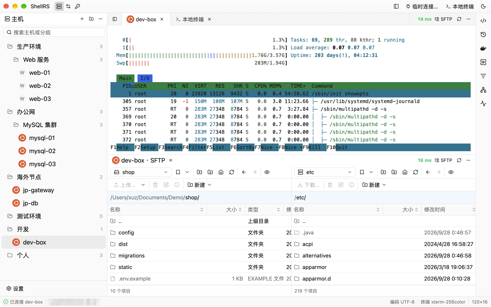
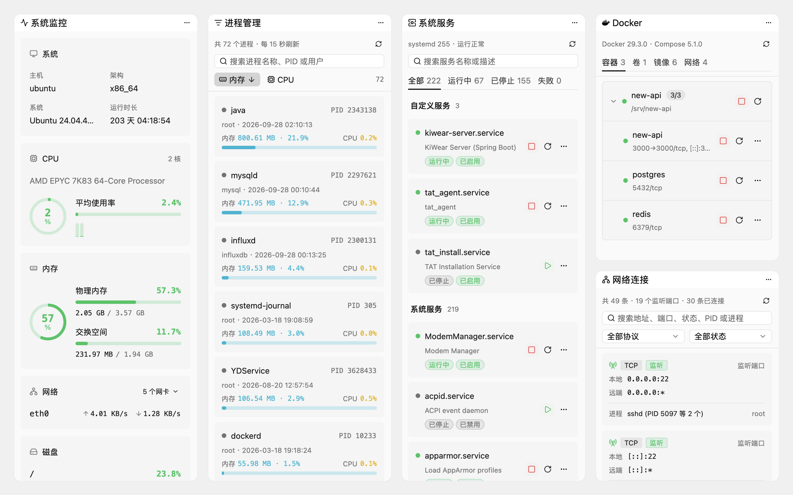
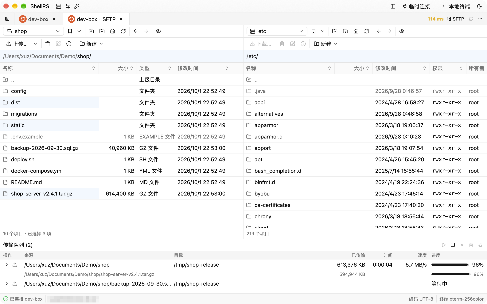
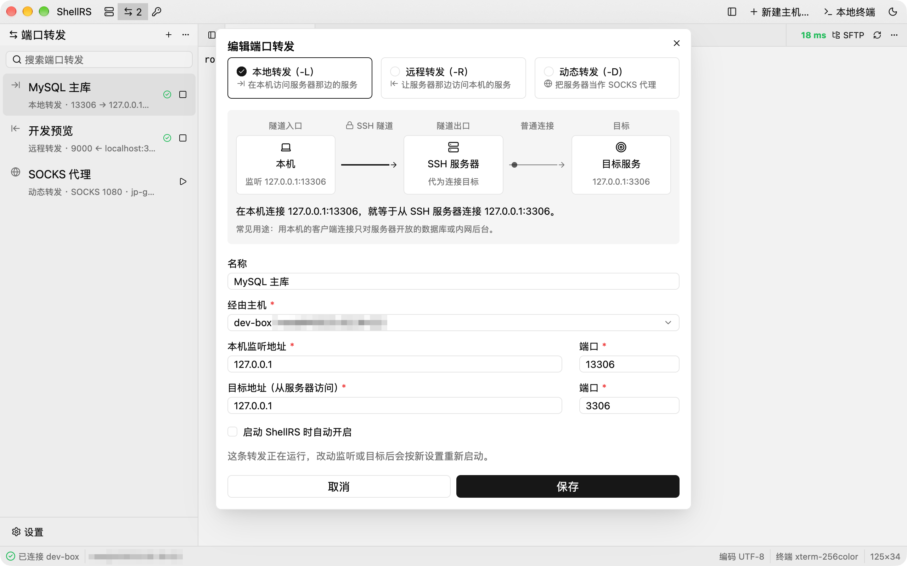

<p align="center">
  
</p>

<h1 align="center">ShellRS</h1>

<p align="center">
  用 Rust 编写、由 GPU 渲染界面的高性能原生跨平台 SSH 客户端：Xshell 式的主机管理、WinSCP 式 SFTP 和端口转发，都在一个窗口里。
</p>

<p align="center">
  <a href="https://github.com/since2006/shell-rs/releases"></a>
  <a href="#许可证"></a>
  
  
</p>

<p align="center"><b>简体中文</b> | <a href="README.en.md">English</a></p>

<picture>
  <source media="(prefers-color-scheme: dark)" srcset="docs/screenshots/main-dark.png">
  
</picture>

## 简介

ShellRS 把 Xshell 式的主机管理和多标签终端、WinSCP 式的双栏 SFTP 文件管理、SSH 端口转发放进同一个跨平台应用，JumpServer 等堡垒机也可以像调用 Xshell、WinSCP 一样调用它。它用 Rust 编写，界面基于 Zed 编辑器的 GPU 加速 UI 框架 GPUI（通过 [gpui-kit](https://gpui-kit.com)），不依赖 Electron 或 JVM。

主机、分组、凭据和转发规则保存在本地的 SQLite 数据库里。密码和私钥口令只存进系统钥匙串（macOS 钥匙串、Windows 凭据管理器、Linux Secret Service），数据库里没有任何秘密。ShellRS 还带一个 `shellrs` 命令，让 Claude Code、Codex 等 AI Agent 用你保存的主机执行命令、传输文件，不用把密码交给它们。

> [!NOTE]
> 界面目前只有简体中文。

## 功能

**主机管理**

- 分组可以任意层级嵌套，支持拖动整理和搜索。
- 连上主机后自动识别远程系统，在主机树和标签上显示对应的系统徽章（各 Linux 发行版、BSD、macOS、Windows）。
- 认证方式三选一：密码、无密码（依次尝试服务器免认证、SSH Agent 和 `~/.ssh` 下的默认私钥）、使用凭据。
- 连接方式三选一：直接连接、多级 SSH 跳板、HTTP / SOCKS5 代理。终端、SFTP、端口转发和外部 CLI 都按它连接。
- 「测试连接」会真实登录一次，失败时写明原因。

**终端**

- 多标签的远程终端和本地终端（基于 `alacritty_terminal`），vim、htop 等全屏程序正常显示。
- 标签栏实时显示这条 SSH 连接的往返延迟。
- 支持查找（智能大小写）和本地清屏，字体、字号、行高都可以设置。
- 标签可以拖成左右或上下分栏，终端和 SFTP 并排看。

**右侧栏工具**

- 跟着当前的远程终端，在这条终端自己的连接上读取和执行，不另外登录；⌘⌥B（其他平台 Ctrl+Alt+B）显示或隐藏。
- 系统监控：系统信息、CPU（含每个核）、内存、网卡速率和磁盘占用，每 2 秒刷新。
- 网络连接、进程管理和系统服务：搜索和筛选，查看进程详情、结束进程，启动、停止、重启 systemd 服务，开关开机启动，查看日志。这三项和系统监控只支持 Linux。
- Docker：按 compose 项目列出容器，启停、重启、看详情和日志，管理卷、镜像和网络。不是 root 时用免密码的 sudo（系统服务也是）。
- 历史命令读主机上的 `~/.bash_history`，命令片段所有主机共用、可以分类；点一下输入到终端，或直接执行。

**SFTP**

- 对标 WinSCP Commander 的双栏文件浏览器：本地和远程两侧对称，WinSCP 的列、路径标签、书签和快捷键（F5、F2、F7、F8……）。
- 拖动或快捷键上传、下载，支持递归。传输进行中还能继续发起，新批次进传输队列依次执行。
- 断点续传：先写 `.filepart`，断线后按 1、3、10 秒自动重连；重启后再传同样的文件，会询问是否续传。
- 删除（本地移到废纸篓）、重命名、新建、修改权限（3×3 复选框加八进制，可递归）。
- 内置编辑器：双击文本文件直接编辑，⌘S 原地写回服务器，保存前检查文件是否被别人改过；常见格式语法高亮。图片和 Markdown 可以预览。
- 每个 SFTP 标签单独建立连接，只请求 SFTP 子系统，不要求服务器提供 shell。

**从堡垒机打开**

- 兼容 Xshell 和 WinSCP 的命令行调用方式：在 JumpServer 等堡垒机的客户端里把 ShellRS 设成 SSH / SFTP 客户端，`ssh://` 链接打开终端，`sftp://` 链接打开 SFTP。
- 认得 Xshell 的 `-url`、`-newtab` 和 WinSCP 的 `/sessionname=`；ShellRS 已在运行时，链接交给正在运行的那个打开。
- 打开的是不保存的外部连接：不进主机列表，链接里的密码只留在内存里，标签关掉就没了。每条连接只用一个通道，不允许多开通道的堡垒机也能用。详见[使用手册](docs/manual.md#从堡垒机打开外部连接)。

**端口转发**

- 本地（`-L`）、远程（`-R`）和动态（`-D`，SOCKS5 / SOCKS4）转发。
- 配置对话框里有实时示意图和一句话说明，看得出连接从哪进、到哪去。
- 每条规则自己建立 SSH 连接，断线后自动重连三次；可以设为随 ShellRS 启动自动开启。

**凭据**

- 密码、密钥、SSH Agent 三种凭据，多台主机可以共用一条；改凭据，用它的主机一起变。
- 密钥可以引用本机文件、直接粘贴，或当场生成 Ed25519 / RSA 4096，并复制公钥。

**给 AI Agent 用的 CLI**

- `shellrs hosts` / `credentials` / `exec` / `upload` / `download` / `sync`：管理主机和凭据、执行命令、传输和同步文件。由正在运行的 ShellRS 代为登录，命令本身不读密码和私钥。
- 在设置页一键把 `shellrs` 放进 PATH，并为 Claude Code、Codex、OpenCode、WorkBuddy 安装 Agent Skill。

**安全与更新**

- 秘密只进系统钥匙串；主机信任记录存在 ShellRS 自己的 `known_hosts` 里，不改动 `~/.ssh`。
- 在线升级：更新清单经 minisign 签名，安装包按 SHA-256 校验；后台下载，重启或退出时安装。分稳定版和 Beta 两个渠道，检查更新只发送版本号、系统和 CPU 架构。
- 匿名使用统计：经 Aptabase 只发送版本、系统、CPU 架构和各功能的使用次数，不含主机、凭据、命令或任何标识，可在「设置 › 关于」关闭。详见[使用手册](docs/manual.md#隐私)。

## 截图

<p align="center">
  <br>
  <em>Dock 分栏：远程终端和 SFTP 上下并排</em>
</p>

<p align="center">
  <br>
  <em>右侧栏工具：系统监控、进程管理、系统服务、Docker 和网络连接</em>
</p>

<p align="center">
  <br>
  <em>WinSCP 式双栏 SFTP：高亮多选，传输队列显示进度、速度和剩余时间</em>
</p>

<p align="center">
  <br>
  <em>端口转发：示意图实时说明连接怎么走</em>
</p>

## 下载

到官网 [shellrs.com/download](https://shellrs.com/download) 下载，页面会按你的系统给出对应的安装包；也可以到 GitHub [Releases](https://github.com/since2006/shell-rs/releases) 下载。Beta 版在 Releases 里标为 Pre-release，想提前用上新功能，可以在「设置 › 关于」里把更新渠道切到 Beta。

| 系统 | 安装包 | 说明 |
| --- | --- | --- |
| macOS 11+（Apple Silicon 和 Intel） | `ShellRS-<版本>-macos-universal.dmg` | 已签名并经过 Apple 公证。打开 DMG，把 ShellRS 拖进「应用程序」 |
| Windows x64 | `ShellRS-<版本>-windows-x86_64-setup.exe` | 按当前用户安装，不需要管理员权限。安装程序暂未签名，SmartScreen 拦下时点「更多信息 › 仍要运行」 |
| Linux x64 | `ShellRS-<版本>-linux-x86_64.AppImage` | `chmod +x` 后直接运行，需要 glibc 2.35 以上（Ubuntu 22.04、Debian 12 及更新的版本） |

每个安装包都附带 minisign 签名（`.minisig`），另有一份 `SHA256SUMS`。

装好之后不用再手动下载：ShellRS 会在后台检查、下载并校验新版本，标题栏右上角出现提示后点「重启并安装」；不点的话，退出时也会自动装好。直接在 DMG 里运行、没放进「应用程序」文件夹，或者在 Linux 上不是用 AppImage 运行时，无法自动更新。

## 快速上手

1. 点标题栏的「新建主机…」（⌘N，Windows / Linux 上 Ctrl+N），填写地址、端口和认证方式，密码会存进系统钥匙串。
2. 双击主机打开终端。第一次连接时会请你确认主机密钥。
3. 右键主机选「打开 SFTP」，或点终端标签栏右侧的「SFTP」，在两栏之间拖动文件即可上传、下载。
4. 标题栏「ShellRS」后面的三个图标切换侧栏：主机、端口转发、凭据。
5. ⌘T（Ctrl+T）打开本地终端。把标签拖到中间区域的上、下、左、右边缘，就能分栏。

## 给 AI Agent 用

在「设置 › 外部 CLI」里打开「启用外部 CLI」，安装 `shellrs` 命令和 Agent Skills。之后 Agent 就能直接用你保存的主机：

```sh
shellrs hosts list -q web                          # 列出主机和它们的 ID
shellrs exec <ID> "uptime && df -h"                # 执行命令，退出码就是远程命令的退出码
shellrs upload <ID> ./dist/app.tar.gz /opt/app/    # 上传
shellrs download <ID> /var/log/syslog ./logs/      # 下载
shellrs sync <ID> ./dist /opt/app --delete         # 同步目录，没变的文件跳过
```

命令把请求交给正在运行的 ShellRS，由它用保存的配置和钥匙串登录。遇到陌生主机或缺少密码时，命令直接失败、返回稳定的错误码，不会弹框卡住 Agent。详见[使用手册](docs/manual.md#外部-cli)。

## 从源码构建

需要先装 [rustup](https://rustup.rs)。仓库里的 `rust-toolchain.toml` 固定了 Rust 1.98.1，第一次构建时会自动安装。

```sh
git clone https://github.com/since2006/shell-rs.git
cd shell-rs
cargo run
```

首次构建要编译整个 GPUI 栈，需要一段时间。Linux 需要的系统依赖和测试方法见[开发与测试](docs/development.md)。

## 文档

- [使用手册](docs/manual.md)：每个功能的详细说明和快捷键
- [开发与测试](docs/development.md)：构建、测试和数据目录
- [发布流程](docs/release.md)：打包、签名和在线更新的发布步骤
- [更新日志](CHANGELOG.md)

## 路线图

以下功能尚未实现：

- 英文界面（目前只有 GPUI Kit 组件自带的文字会切换语言）
- SFTP 的目录同步、过滤、查找文件和目录树
- Dock 布局在重启后保留
- 跳板和代理叠加使用、HTTPS 代理
- 通过外部 CLI 管理端口转发和凭据
- Windows 安装程序的代码签名

## 参与贡献

欢迎提交 [Issue](https://github.com/since2006/shell-rs/issues) 和 Pull Request。架构说明和代码约定见 [CLAUDE.md](CLAUDE.md)。提交前请确认下面三条都通过：

```sh
cargo fmt --check
cargo clippy --all-targets -- -D warnings
cargo test
```

## 致谢

- [GPUI](https://github.com/zed-industries/zed)（Zed）和 [gpui-kit](https://gpui-kit.com)：界面框架
- [russh](https://github.com/Eugeny/russh) 和 [russh-sftp](https://github.com/AspectUnk/russh-sftp)：SSH 与 SFTP 协议
- [alacritty_terminal](https://crates.io/crates/alacritty_terminal) 和 [portable-pty](https://crates.io/crates/portable-pty)：终端模拟与本地 PTY
- [keyring](https://crates.io/crates/keyring)：系统钥匙串
- [Simple Icons](https://simpleicons.org)：系统徽章和右侧栏 Docker 工具使用的 logo（CC0）
- [WinSCP](https://winscp.net) 和 Xshell：交互设计的参照

## 许可证

ShellRS 以 [GNU 通用公共许可证第 3 版（GPL-3.0）](LICENSE)发布。你可以自由使用、修改和再分发，包括用于商业用途；但分发修改后的版本时，必须同样以 GPL-3.0 公开完整的源代码。
